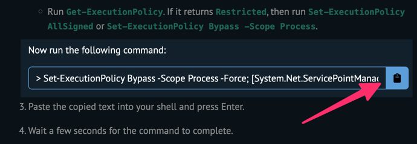

# Windows 開発者向けドキュメント

このドキュメントは、Windows での開発に関する情報を提供します。

インストール系の操作は Powershell を管理者権限で実行する前提とします。

## 開発者モードの有効化

https://paso-kake.com/it/windows11/18020/

## `Chocolatey` のインストール

`Chocolatey` は、Windows でのパッケージ管理を簡単にするためのツールです。

[Chocolatey Software | Installing Chocolatey](https://chocolatey.org/install#individual)

画像の部分のコマンドをコピーします。



コピーしたコマンドを実行して、`Chocolatey` をインストールします。

```powershell
# Example
Set-ExecutionPolicy Bypass -Scope Process -Force; [System.Net.ServicePointManager]::SecurityProtocol = [System.Net.ServicePointManager]::SecurityProtocol -bor 3072; iex ((New-Object System.Net.WebClient).DownloadString('https://community.chocolatey.org/install.ps1'))
```

## `dart-sdk` のインストール

https://dart.dev/get-dart

```powershell
choco install dart-sdk
```

## `melos` のインストール

https://melos.invertase.dev/getting-started#installation

```powershell
dart pub global activate melos
```

## `fvm` のインストール

2023/04/02 現在、`fvm` は `Chocolatey` 経由でインストールすると `Dart` のバージョンが古くなってしまいます。
https://github.com/fluttertools/fvm/issues/474

以下の手順でインストールしてください。

https://fvm.app/docs/getting_started/installation

```powershell
dart pub global activate fvm
```

## `dart pub` のアップグレード

`dart pub global activate` でインストールしたパッケージをアップグレードする場合は、以下のコマンドを実行してください。

```powershell
dart pub upgrade
```

## `bootstrap` スクリプトの実行

以下のコマンドを実行してください。

```powershell
powershell -ExecutionPolicy RemoteSigned -File .\tools\bootstrap.ps1
```